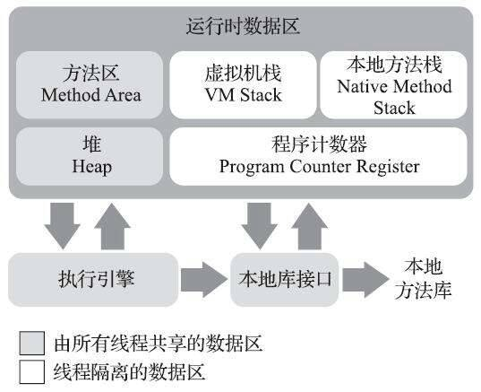

# 运行时数据区域

## 1. 程序计数器 (Program Counter Register)

- 较小内存空间
- 如果是 Java 方法，记录当前线程正在执行的虚拟机字节码指令的地址
- 如果是本地 (Native) 方法，值为空 (Undefined)
- 线程安全/线程私有
- 《Java 虚拟机规范》没有规定 OutOfMemoryError 情况的区域

## 2. Java 虚拟机栈 (Java Virtual Machine Stack)

- 线程安全/线程私有
- Java 方法执行的线程内存模型：每个方法被执行的时候，Java 虚拟机都会同步创建一个栈帧 (Stack Frame) 用于存储局部变量表、操作数栈、动态连接、方法出口灯信息。每一个方法被调用直至执行完毕的过程，就对应着一个栈帧在虚拟机栈中从入栈到出栈的过程。
- 局部变量表存放了编译期可知的各种 Java 虚拟机基本数据类型 (boolean byte char short int float long double)、对象引用 (reference 类型：执行对象起始地址的引用地址、或指向一个代表对象的句柄或者其他与对象相关的位置）、returnAddress 类型（指向一条字节指令的地址）。
- 局部变量表中的存储空间以局部变量槽 (Slot) 表示，64 位长度的 long 和 double 占两个槽，其他类型占一个槽。
- 《Java 虚拟机规范》规定两种情况：如果线程请求的栈深度大于虚拟机允许的深度，抛出 StackOverflowError 异常；如果容量动态扩展，当无法申请足够内存时，抛出 OutOfMemoryError 异常。

## 3. 本地方法栈 (Native Method Stack)

- 作用与 Java 虚拟机栈类似，区别在于本地方法栈服务于本地 (Native) 方法
- HotSpot 将本地方法栈和虚拟机栈合二为一

## 4. Java 堆 (Java Heap)

- 非线程安全/线程共享
- 最大内存空间
- 绝大数对象在堆中（《Java 虚拟机规范》描述的是所有对象实例及数组应当在堆上分配）
- G1 之前，HotSpot 虚拟机的垃圾收集器采用经典分代（新生代、老年代，新生代分为一个 Eden 和两个 Survivor）设计。
- 物理上不连续，逻辑上连续
- 通过参数-Xmx 和-Xms 设定堆大小

## 5. 方法区 (Method Area)

- 非线程安全/线程共享
- 用于存储已被虚拟机加载的类型信息、常量、静态常量、即时编译器编译后的代码缓存等数据
- 《Java 虚拟机规范》把方法区描述为堆的逻辑部分，但是又有一个别名“非堆”(Non-Heap)，目的是与堆区分开
- HotSpot 虚拟机在 JDK8 之前，通过永久代 (Permanent Generation) 的方式实现了方法区，JDK8 使用元空间 (Metaspace) 代替永久代。
- 无法满足新的内存分配需求时，会抛出 OutOfMemoryError 异常

## 6. 运行时常量池 (Runtime Constant Pool)

- 属于方法区的一部分
- 存放 Class 文件中的常量池表 (Constant Pool Table)，是编译期生成的各种字面量和符号引用。
- 存放运行期间产生的常量（比如 String 的 intern 方法产生的常量）
- 无法申请到足够内存时，会抛出 OutOfMemoryError 异常

>Class 文件包含类的版本、字段、方法、接口等描述信息，还有存放编译期生成的字面量和符号引用的常量池表。

## 7. 直接内存 (Direct Memory)

- 不属于虚拟机运行时数据区的一部分，也不是《Java 虚拟机规范》中定义的内存区域
- 也会引起 OutOfMemoryError 异常
- 受本机总内存（包括物理内存、SWAP 分区或分页文件）大小以及处理器寻址空间的限制
