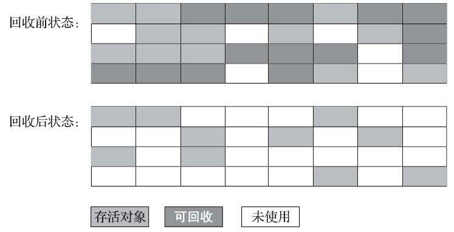
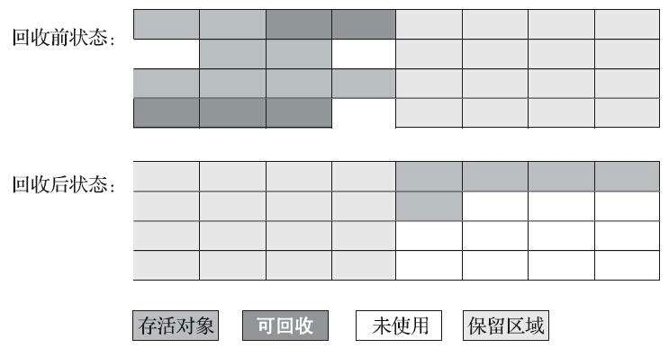
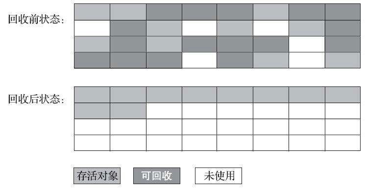

# 垃圾收集算法

从如何判断对象消亡的角度出发，垃圾收集算法可以划分为“引用计数式垃圾收集”（Reference Counting GC）和“追踪式垃圾收集”（Tracing GC）两大类，这两大类也常被称作“直接垃圾收集”和“间接垃圾收集”。

>主流 GC 算法均未涉及引用计数式垃圾收集，所以本文所有算法均为追踪式垃圾收集的范畴。

## 1. 分代收集理论

分代收集（Generational Collection），建立在三个假设上：

1. 弱分代假说（Weak Generational Hypothesis）：绝大多数对象都是朝生夕灭的。
2. 强分代假说（Strong Generational Hypothesis）：熬过越多次垃圾收集过程的对象就越难消亡。
3. 跨代引用假说（Intergenerational Reference Hypothesis）：跨代引用相对于同代引用来说仅占极少数。

根据前两个分代假说，奠定了多款常用垃圾收集器的一致的设计原则：收集器应该将 Java 堆划分出不同的区域，然后将回收对象依据年龄分配到不同的区域中存储。

一般至少将 Java 堆划分为新生代（Young Generation）和老年代（Old Generation）。

分代收集理论除了划分内存区域，还需要解决其他问题，比如：**对象不是孤立的，对象之间会存在跨代引用**。为了解决这个问题，就出现了第三条假说。

第三条假说是根据前两条假说逻辑推理得出的隐含推论：存在相互引用关系的两个对象，是应该倾向于同时生存或者同时消亡的。

依据这条假说，我们就不应再为少量的跨代引用去扫描整个老年代，也不必浪费空间专门记录每个对象是否存在及存在哪个跨代引用，只需在新生代上建立一个全局的数据结构，被称为记忆集（Remembered Set），这个结构把老年代划分成若干小块，标识老年代哪一块内存会存在跨代引用。当发生 Minor GC 时，只有包含了跨代引用的小块内存里的对象才会被加入到 GC Roots 进行扫描。

名词解释：

- 部分收集（Partial GC）：指目标不是完整收集整个 Java 堆的垃圾收集
  - 新生代收集（Minor GC/Young GC）：指目标只是新生代的垃圾收集
  - 老年代收集（Major GC/Old GC）：值目标只是老年代的垃圾收集。目前只有 CMS 收集器会有单独收集老年代的行为。
- 混合收集（Mixed GC）：指目标是收集整个新生代以及部分老年代的垃圾收集。目前只有 G1 收集器会有这种行为。
  - 整堆收集（Full GC）：收集整个 Java 堆和方法区的垃圾收集。

## 2. 标记-清除算法

标记-清除（Mark-Sweep）算法：标记所有需要回收对象，在标记完成后，统一回收掉所有被标记的对象；或者，标记存活的对象，统一回收所有未被标记的对象。

缺点：

1. 执行效率不稳定，如果 Java 堆中包含大量对象，而且其中大部分需要被回收，这时必须进行大量标记和清除的动作，导致标记和清除的执行效率随对象数量增长而降低；
2. 内存空间的碎片化问题，标记、清除之后会产生大量不连续的内存碎片，空间碎片太对可能会导致当以后程序运行过程中需要分配较大对象时无法找到足够连续的内存而不得不触发另一次垃圾收集动作。

## 3. 标记-复制算法

半区复制（Semispace Copying）算法：将可用内存按容量划分大小相等的两块，每次只使用其中一块。当一块内存用完了，就将还存活着的对象复制到另外一块上，然后再把已使用过的内存空间一次清理掉。

Appel 式回收：把新生代分为一块较大的 Eden 空间和两块较小的 Survivor 空间，每次分配内存只使用 Eden 和其中一块 Survivor。发生垃圾收集时，将 Eden 和 Survivor 中仍然存活的对象一次性复制到另外一块 Survivor 空间上，然后直接清理掉 Eden 和已用过的那块 Survivor 空间。如果 Survivor 空间不足以容纳 Minor GC 后存活对象时，这些对象通常分配进入老年代。

HotSpot 虚拟机默认 Eden 和 Survivor 大小比例是 8:1，即每次新生代中可用内存空间为整个新生代容量的 90%，只有一个 Survivor 空间被浪费。

Appel 式回收的理论依据：IBM 公司的研究表明，新生代中的对象有 98%熬不过第一轮收集。

## 4. 标记-整理算法

标记-整理（Mark-Compact）算法，其中标记过程与“标记-清除”算法一样，整理过程是让所有存储哦对象都向内存空间的一端移动，然后直接清理掉边界以外的内存。

标记整理算法的弊端是移动存活对象并更新所有引用工作量比较大，而且需要 Stop The World，会造成延迟。

标记清除算法的弊端是由于空间碎片化，需要复杂的内存分配器和内存访问器，会影响吞吐量。

HotSpot 虚拟机里面关注吞吐量的的 Parallel Scavenge 收集器是基于标记-整理算法的，关注延迟的 CMS 收集器是基于标记-清除算法的。

还有一种“和稀泥”的方式，大部分时间使用标记-清除算法，容忍内存碎片，当内存碎片影响对象分配时，再采用标记-整理算法收集一次，以获得规整的内存空间。
