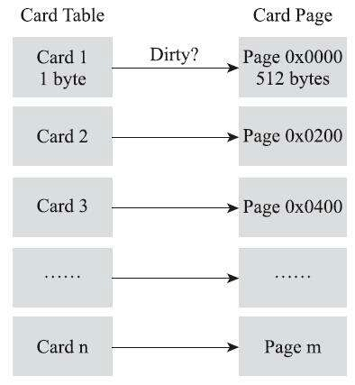
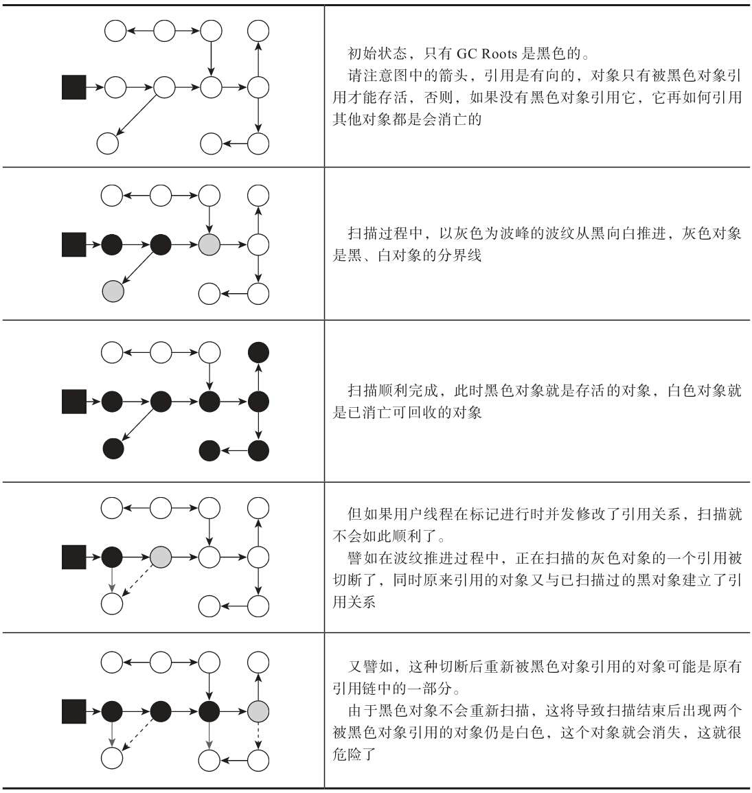

# HotSpot 的算法细节实现

## 1. 根节点枚举

迄今为止，**所有**收集器在根节点枚举这一步骤，都会暂停用户线程，即：Stop The World。

目前主流 Java 虚拟机使用的都是准确式垃圾收集，所以当用户线程停顿后，其实不需要一个不漏的检查完所有执行上下文和全局的引用位置。在 HotSpot 中，使用一组称为 OopMap 的数据结构，来直接得到哪些地方存放着对象引用。

类加载动作完成，HotSpot 会把对象内什么偏移量上是什么类型的数据计算出来，在即时编译过程中，也会在特定的位置记录栈里和寄存器里哪些位置是引用。这样收集器在扫描时就可以直接得知这些信息，并不需要真正一个不漏的从方法区等 GC Roots 开始查找。

```assembly
[Verified Entry Point]
0x026eb730: mov    %eax,-0x8000(%esp)
…………
;; ImplicitNullCheckStub slow case
0x026eb7a9: call   0x026e83e0       ; OopMap{ebx=Oop [16]=Oop off=142}
                                    ; *caload
                                    ; - java.lang.String::hashCode@48 (line 1489)
                                    ;   {runtime_call}
    0x026eb7ae: push   $0x83c5c18   ;   {external_word}
    0x026eb7b3: call   0x026eb7b8
    0x026eb7b8: pusha
    0x026eb7b9: call   0x0822bec0   ;   {runtime_call}
    0x026eb7be: hlt
```

## 2. 安全点（SafePoint）

在 OopMap 的协助下，HotSpot 可以快速准确完成 GC Roots 枚举，但是可能导致引用关系变化或者 OopMap 内容变化的指令非常多，如果为每一条指令生成对应的 OopMap，将需要大量的存储空间。

为了解决这个问题，HotSpot 只在特定的位置记录信息，称为安全点（SafePoint）。同时，也决定了用户程序执行时并非在代码指令流的任意位置都能够停顿下来开始垃圾收集，而是强制要求必须执行到安全点才能暂停。安全点的位置以“是否具有让程序长时间执行的特征”为标准进行选定的，“长时间执行”的最明显特征就是指令序列的复用，例如方法调用、循环跳转、异常跳转等都属于指令序列复用，所有只有具有这些功能的指令才会产生安全点。

对于安全点，还有一个需要考虑的问题，如何在垃圾收集发生时让所有线程（不包括执行 JNI 调用的线程）都跑到最近的安全点，然后停顿下来。有两种方案：

- 抢先式中断（Preemptive Suspension）：当垃圾收集发生时，系统首先把所有用户线程全部中断，如果发现用户线程中断的地方不在安全点上，就恢复这条线程重新执行，一会再重新中断，直到跑到安全点上。
- 主动式中断（Voluntary Suspension）：当垃圾收集发生时，设置一个标志位，各个线程执行过程中，主动查询这个标志，如果发现中断标志为真，就在最近的安全点上主动中断挂起。查询标志的地方需要两种：
  - 安全点位置
  - 创建对象和其他需要在 Java 堆上分配内存的地方（为了检查是否即将发生垃圾收集，避免没有足够内存分配新对象）

查询操作在代码中会频繁出现，为了保证足够高效，HotSpot 使用内存保护陷阱的方式，把查询操作精简至只有一条汇编指令的程度。如下面的代码，test 指令是 HotSpot 生成的查询指令，当需要暂停用户线程时，虚拟机把 0x160100 的内存页设置为不可读，那线程执行到 test 指令时就会发生一个自陷异常信号，然后在预先注册的异常处理器中挂起线程实现等待，这样仅通过一条汇编指令便完成安全点查询和触发线程中断了。

```assembly
0x01b6d627: call   0x01b2b210          ; OopMap{[60]=Oop off=460}
                                       ; *invokeinterface size
                                       ; - Client1::main@113 (line 23)
                                       ;   {virtual_call}
    0x01b6d62c: nop                    ; OopMap{[60]=Oop off=461}
                                       ; *if_icmplt
                                       ; - Client1::main@118 (line 23)
    0x01b6d62d: test   %eax,0x160100   ;   {poll}
    0x01b6d633: mov    0x50(%esp),%esi
    0x01b6d637: cmp    %eax,%esi
```

## 3. 安全区域（Safe Region）

安全区域是指能够确保在某一段代码片段之中，引用关系不会发生变化的区域，在这个区域中任意地方开始垃圾收集都是安全的。安全区域是为了解决用户线程没有分配处理时间的情况，比如用户线程处于 Sleep 状态或 Blocked 状态。

1. 当用户线程执行到安全区域时，首先标识自己已经进入安全区域，当这段时间发生垃圾收集，虚拟机就可以不用管这部分线程。
2. 当用户线程离开安全区域时，检查虚拟机是否已经完成了根节点枚举或垃圾收集中其他需要暂停用户线程的阶段
   1. 如果是，用户线程继续执行
   2. 如果否，用户线程需要等待，直到收到可以离开安全区域的信号未知。

## 4. 记忆集（Remembered Set）与卡表（Card Table）

>所有涉及部分收集（Partial GC）行为的垃圾收集器，都会面临扫描跨代引用的问题。

记忆集是一种用于记录从非收集区域指向收集区域的指针集合的抽象数据结构。

在垃圾收集场景中，收集器只需要通过记忆集判断出某块非收集区域是否存在有指向收集区域的指针即可，不需要了解这些跨代指针的全部细节，所以不需要用非收集区域所有含跨代引用的对象数组来实现记忆集。

一般有如下可供选择的记录精度：

- 字长精度：每个记录精确到一个机器字长（就是处理器的寻址位数，如 32 位或 64 位，这个精度决定了机器访问物理内存地址的指针长度），该字包含跨代指针。
- 对象精度：每个记录精确到一个对象，该对象里有字段含有跨代指针。
- 卡精度：每个记录精确到一块内存区域，该区域内有对象含有跨代指针。

第三种“卡精度”所指的是“卡表”的方式，是目前最流行的一种记忆集实现形式。

卡表最简单的形式是字节数组（这是考虑到现代计算机硬件都是最先按字节寻址的，如果要用 bit 的话，需要多消耗几条 shift+mask 指令），HotSpot 默认的卡表标记逻辑：

```c++
CARD_TABLE[this address >> 9] = 0;
```

字节数组 CARD_TABLE 的每一个元素对应着其标识的内存区域中一块特定大小的内存块，这个内存块称为卡页（Card Page）。一般卡页大小都是以 2 的 N 次幂的字节数，HotSpot 中使用的卡页是 2 的 9 次幂，及 512 字节，示意图如下：



一个卡页内存中通常包含不止一个对象，只要卡页内有一个对象字段存在跨代指针，对应卡表的数组元素值标识为 1，称为这个元素变脏（Dirty），没有则标识 0。在垃圾收集发生时，只要筛选出卡表中变脏的元素，就能轻易得出哪些卡页内存块中包含跨代指针，把它们加入 GC Roots 中一并扫描。

## 5. 写屏障（Write Barrier）

卡表元素何时变脏？有其他分代区域中对象引用了本区域对象时，其对应的卡表元素就应该变脏，变脏的时间点原则上应该发生在引用类型字段赋值的那一刻。

如何维护卡表呢？在 HotSpot 虚拟机通过写屏障技术维护卡表状态。

写屏障可以看做在虚拟机层面对“引用类型字段赋值”这个动作的 AOP 切面，在引用对象复制时会产生一个环形（Around）通知，供程序执行额外的动作，也就是说赋值的前后都在写屏障的覆盖范围内。赋值前的部分的写屏障叫写前屏障（Pre-Write Barrier），赋值后的叫做写后屏障（Post-Write Barrier）。

如下是一段写后屏障更新卡表状态简化逻辑：

```c++
void oop_field_store(oop* field, oop new_value) {
    // 引用字段赋值操作
    *field = new_value;
    // 写后屏障，在这里完成卡表状态更新
    post_write_barrier(field, new_value);
}
```

应用写屏障后，虚拟机就会为所有赋值操作生成相应的指令，一旦收集器在写屏障中增加了更新卡表操作，无论更新的是不是老年代对新生代对象的引用，每次只要对引用进行更新，就会产生额外开销。

除了写屏障的开销外，卡表在高并发场景下还面临着“伪共享”（False Sharing）问题。伪共享是处理并发底层细节时一种经常需要考虑的问题，现代中央处理器的缓存系统中是以缓存行（Cache Line）为单位存储的，当多线程修改相互独立的变量时，如果这些变量恰好共享同一个缓存行，就会彼此影响（写回、无效化、同步）而导致性能降低，这就是伪共享问题。

为了避免伪共享问题，一种简单的解决方案是不采用无条件的写屏障，而是先检查卡表标记，只有当该卡表元素未被标记过时才将其标记为变脏，即将卡表更新的逻辑变为一下代码所示：

```c++
if (CARD_TABLE[this address >> 9] != 0)
    CARD_TABLE[this address >> 9] = 0;
```

在 JDK7 之后，HotSpot 虚拟机增加了-XX:+UseCondCardMark 参数来设置是否开启卡表更新的条件判断。

## 6. 并发的可达性分析

可达性分析算法理论上要求全部过程都基于一个能保障一致性的快照中才能进行分析，这意味着必须全程冻结用户线程的运行。

为了能解释为什么必须在一个能保障一致性的快照上才能进行对象图遍历的问题，引入三色标记（Thi-color Marking）作为工具辅助推导，把遍历对象图过程中遇到的对象，按照“是否访问过”这个条件标记成一下三种颜色：

- 白色：表示对象尚未被垃圾收集器访问过，显然在可达性分析刚刚开始的阶段，所有的对象都是白色的，若在分析结束的阶段，仍然是白色的对象，即代表不可达。
- 黑色：表示对象已经被垃圾收集器访问过，且这个对象的所有引用都已经扫描过，它是安全存活的，如果有其他对象引用了黑色对象，无须重新扫码一遍。黑色对象不可能直接（不经过灰色对象）指向某个白色对象。
- 灰色：表示对象已经被垃圾收集器访问过，但这个对象上至少存在一个引用还没有被扫描过。

收集器在对象图上标记颜色，同时用户线程在修改引用关系，这样可能出现两种结果：

- 把原本消亡的对象错误标记为存活，这种可以容忍，下次收集时清理即可。
- 把原本存活的对象错误标记为消亡，这就会出现各种问题，比较致命了。



Wilson于1994年在理论上证明了，当且仅当一下两个条件同时满足时，会发生“对象消失”的问题，即原本是黑色的对象被误标记为白色：

- 赋值器插入了一条或多条从黑色对象到白色对象的新引用
- 赋值器删除了全部从灰色对象到该白色对象的直接或间接引用

由此产生两种解决方案：

- 增量更新（Incremental Update）：破坏第一个条件，当黑色对象插入新的指向白色对象的引用关系时，将这个新插入的引用记录下来，等并发扫码结束后，再将这些记录过的引用关系中黑色对象为根，重新扫描一次。这可以简化理解为，黑色对象一旦新插入了指向白色对象的引用后，它就变回灰色对象了。
- 原始快照（Snapshot At The Beginning，SATB）：破坏第二个条件，当灰色对象要删除指向白色对象的引用关系时，就将这个要删除的引用记录下来，在并发扫描结束后，再将这些记录过的引用关系中的灰色对象为根，重新扫描一次。这也可以简化理解为，无论引用关系删除与否，都会按照刚刚开始扫描那一刻的对象图快照来进行搜索。
