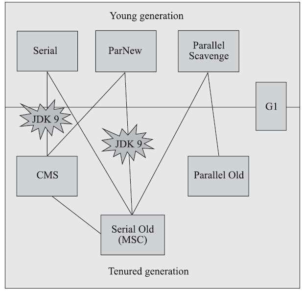
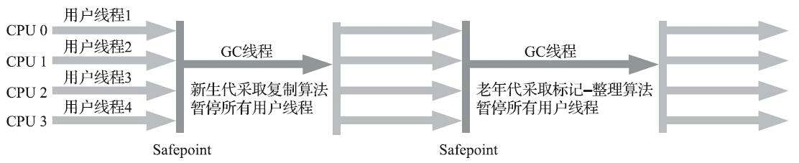
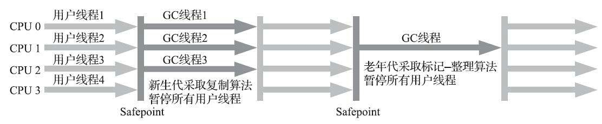
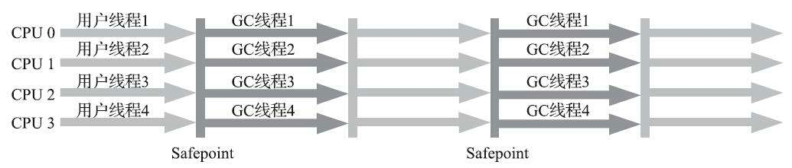
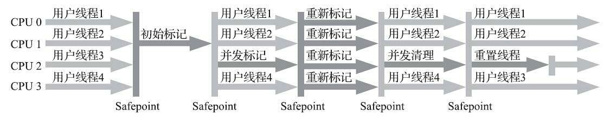
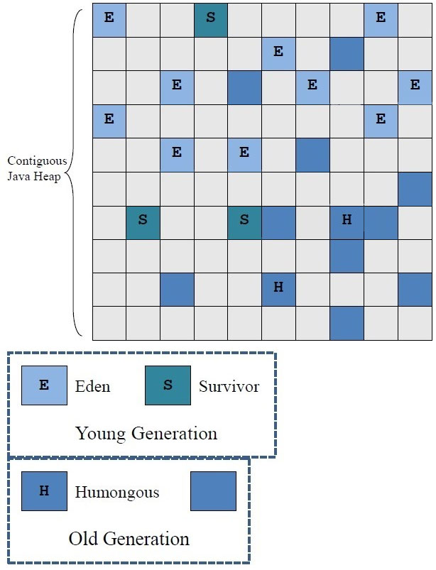
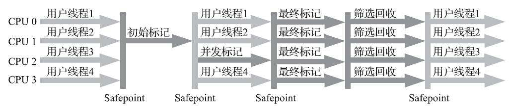

# 经典垃圾收集器

上图中两个收集器之间存在连线的，说明可以搭配使用。

## 0. 概念

在谈论垃圾收集器的上下文语境中

- 并行（Parallel）：并行描述的是多条垃圾收集器线程之间的关系，说明同一时间有多条这样的线程协同工作，通常默认此时用户线程时处于等待状态。
- 并发（Concurrent）：并发描述的是垃圾收集器线程与用户线程之间的关系，说明同一时间垃圾收集器与用户线程都在运行。由于用户线程并未被冻结，所以程序仍然响应服务请求，但由于垃圾收集器线程占用了一部分系统资源，此时应用程序的吞吐量受到一定影响。

## 1. Serial 收集器

- 是 HotSpot 虚拟机运行在客户端模式下的默认新生代收集器
- 简单高效（与其他收集器的单线程相比）
- 对内存资源受限的环境，是所有收集器里额外内存消耗（Memory Footprint，内存占用，为保证垃圾收集能够顺利高效进行而存储的额外信息）最小的
- 没有线程交互开销，可以获得最高的单线程收集效率
- 对于运行在客户端模式下的虚拟机是一个很好的选择

## 2. ParNew 收集器

新生代收集器。

ParNew 收集器是 Serial 收集器的多线程并行版本，与 Serial 收集器共用控制参数、收集算法、Stop The World、对象分配规则、回售策略等。

除了 Serial 收集器外，目前只有 ParNew 能与 CMS 收集器配合工作。原因是只有 ParNew 或 Serial 收集器实现了 HotSpot 中原本设计的垃圾收集器的分代框架。ParNew 收集器是激活 CMS 后（使用`-XX:+UseConcMarkSweepGC`选型）的默认新生代收集器，也可以使用`-XX:+/-UseParNewGC`选项强制指定或禁用它。

JDK9 之后，取消了`-XX:+UseParNewGC`参数，意味着其只能与 CMS 配合使用，或可以理解为 ParNew 并入 CMS，称为它专门处理新生代的组成部分。ParNew 可以说是 HotSpot 虚拟机第一款退出历史舞台的垃圾收集器。

ParNew 收集器在单核处理器环境中不比 Serial 收集器优秀。它默认开启收集线程数与处理器核心数量相同，可以通过-XX:ParallelGCThreads 参数来限制垃圾收集的线程数。

## 3. Parallel Scavenge 收集器

新生代收集器，基于标记-复制算法，能够并行收集的多线程收集器，被称为“吞吐量优先收集器”。

其他收集器关注点是尽可能地缩短垃圾收集时用户线程的停顿时间，而 Parallel Scavenge 收集器的目标是达到一个可控制的吞吐量（Throughput，吞吐量=处理器用于运行用户代码的时间/处理器总消耗时间，用户代码加垃圾收集总耗费 100 分钟，垃圾收集花费 1 分钟，吞吐量即为 99%）。

停顿时间越短越适合需要与用户交互或需要保证服务响应质量的程序，良好的响应速度能提升用户体验；高吞吐量可以最高效率地利用处理器资源，尽快完成程序的运行任务，主要适合在后台运算而不需要太多交互的分析任务。

Parallel Scavenge 提供两个参数用于精确控制吞吐量：

- 控制最大垃圾收集停顿时间的`-XX:MaxGCPauseMillis`：参数为一个大于 0 的毫秒数。垃圾收集的停顿时间是以牺牲吞吐量和新生代空间为代价换取的。停顿时间调小后，垃圾收集频率就会上升。
- 设置吞吐量大小的`-XX:GCTimeRatio`：大于 0 小于 100 的整数，默认值为 99。假设值设为 n，则用于垃圾收集的时间不超过总时间的 1/(1 + n)。吞吐量与这个参数的关系是，吞吐量 = n / (n + 1)。

>具体内容可以查看[Garbage Collector Ergonomics](https://docs.oracle.com/javase/1.5.0/docs/guide/vm/gc-ergonomics.html)

还有一个参数是 Parallel Scavenge 收集器区别于 ParNew 收集器的重要特性：

- 垃圾收集的自适应调节策略（GC Ergonomics）开关`-XX:+UseAdaptiveSizePolicy`：不需要人工指定新生代大小（`-Xmn`）、Eden 和 Survivor 区的比例（`—XX:SurvivorRatio`）、晋升老年代对象大小（`-XX:PretenureSizeThreshold`）等细节参数了，虚拟机会根据当前系统运行情况收集性能监控信息，动态调整参数，以提供最合适的停顿时间或者最大的吞吐量。

## 4. Serial Old 收集器

工作过程如图：

是 Serial 收集器的老年代版本，单线程收集器，使用标记-整理算法。主要意义是供客户端模式下的 HotSpot 虚拟机使用。

如果在服务端：

- 在 JDK5 及之前版本与 Parallel Scavenge 收集器搭配使用
- 作为 CMS 收集器发生失败时的后备方案，在并发收集发生 Concurrent Mode Failure 时使用。

## 5. Parallel Old 收集器

工作过程如图：

Parallel Old 是 Parallel Scavenge 收集器的老年代版本，支持多线程并发收集，基于标记-整理算法实现。而且可以与 Parallel Scavenge 一起组合成完整的吞吐量优先收集器。在注重吞吐量或处理器资源较为稀缺的场合，都可以优先考虑 Parallel Scavenge 加 Parallel Old 收集器这个组合。

## 6. CMS 收集器

CMS（Concurrent Mark Sweep）收集器是一种以获取最短回收停顿时间为目标的收集器，特点是并发收集、低停顿，有时被称为“并发低停顿收集器（Concurrent Low Pause Collector）”。基于标记-清除算法，整个过程分为四步：

1. 初始标记（CMS initial mark）：STW，标记 GC Roots 能直接关联到的对象，速度很快。
2. 并发标记（CMS concurrent mark）：从 GC Roots 的直接关联对象开始遍历整个对象图，耗时长，但是不需要停顿用户线程。
3. 重新标记（CMS remark）：STW，为了修正并发标记期间，因用户线程继续运行而导致标记产生变动的那一部分对象的标记记录（即增量更新），比初始标记长，但远比并发标记短。
4. 并发清除（CMS concurrent sweep）：清理删除掉标记阶段判断的已经死亡对象，与用户并发。

工作过程如图：

三个明显的缺点：

1. 对处理器资源非常敏感。在并发阶段，虽然不会导致用户线程停顿，但是会因为占用一部分线程（或处理器计算能力）而导致应用程序变慢，降低总吞吐量。CMS 默认启动的回收线程数是：（处理器核心数量 + 3) / 4，当处理器不足 4 个时，对用户线程影响比较大。为了缓解这种情况，虚拟机提供一种称为“增量式并发收集器”（Incremental Concurrent Mark Sweep/i-CMS）的 CMS 收集器变种，是在并发标记、并发清除的过程中，让收集器线程、用户线程交替运行，尽量减少垃圾收集线程独占资源的时间。这样的结果是，垃圾收集时间变长，但是对用户线程的影响降低。实践证明，增量式 CMS 收集器效果一般，从 JDK7 开始，i-CMS 模式被声明为“deprecated”，到 JDK9 已经被废弃。
2. 无法处理“浮动垃圾（Floating Garbage）”，有可能出现“Concurrent Mode Failure”失败进而导致另一次完全“Stop The World”的 Full GC。在并发标记和并发清除阶段，用户线程运行产生的垃圾对象会留到下一次垃圾收集，这部分垃圾被称为浮动垃圾。同样，因为垃圾收集阶段用户线程持续运行，所以需要预留足够空间提供给用户线程使用。JDK5 中默认设置，CMS 收集器是在老年代使用了 68%后被激活，JDK6 是 92%，可以通过`-XX:CMSInitiatingOccupancyFraction`的值来提高 CMS 触发百分比，降低内存回收频率。如果 CMS 运行期间预留的内存无法满足用户线程分配新对象需要，会出现一次“并发失败（Concurrent Mode Failure）”，此时，会启动后备预案：冻结用户线程，临时启动 Serial Old 收集器重新进行老年代收集。
3. CMS 基于标记-清除算法，会产生大量空间碎片。可能在没有足够大连续空间分配给当前对象时，触发 Full GC 的情况，所以 CMS 收集器提供了一个`-XX:+UseCMSCompactAtFullCollection`开关参数（默认开启，在 JDK9 被废弃），用于在 CMS 收集器进行 Full GC 时开启内存碎片合并整理过程，这个过程需要移动存活对象，无法并发。所以还有一个参数`-XX:CMSFullGCsBeforeCompaction`（JDK9 开始废弃），要求 CMS 收集器在执行若干次不整理空间的 Full GC 后，下一次进入 Full GC 前线整理碎片（默认为 0，表示每次进入 Full GC 都进行碎片整理）。

## 7. Garbage First 收集器

Garbage First（简称 G1）收集器是垃圾收集器技术发展历史上的里程碑式的成功，开创了收集器面向局部手机的设计思路和基于 Region 的内存布局形式，被官方称为“全功能的垃圾收集器（Fully-Featured Garbage Collector）”。

G1 是面向服务端应用的垃圾收集器。JDK9 开始，G1 称为默认垃圾收集器，取代之前的 Parallel Scavenge + Serial Old（PS MarkSweep）组合，而 CMS 被声明为不推荐使用（Deprecate）的收集器。

>停顿时间模型（Pause Prediction Model）：能够支持指定在一个长度为 M 毫秒的时间片段内，消耗在垃圾收集上的时间大概率不超过 N 毫秒。

G1 面向堆内存任何部分来组成回收集（Collection Set，一般简称 CSet）进行回收，衡量标准不再是它属于哪个分代，而是哪块内存中存放的垃圾数量最多，回收收集最大，这就是 G1 收集器的 Mixed GC 模型。

G1 开创的基于 Region 的堆内存布局是它能够实现这个目标的关键。虽然 G1 也扔是遵循分代收集理论设计的，但其堆内存的布局与其他收集器有非常明显的差异：G1 不再坚持固定大小以及固定数量的分代区域划分，而是把连续的 Java 堆划分为多个大小相等的独立区域（Region），每一个 Region 都可以根据需要，扮演新生代的 Eden 空间、Survivor 空间，或者老年代空间。收集器能够对扮演不同角色的 Region 采用不同的策略去处理，这样无论是新创建的对象还是已经存活一段时间、熬过多次手机的旧对象都能获取很好的收集效果。

Region 还有一类特殊的 Humongous 区域，专门用来存储大对象。G1 认为只要超过 Region 容量一半的对象即可判定为大对象。每个 Region 的大小可以通过参数`-XX:G1HeapRegionSize`设定，取值范围为 1MB~32MB，其应为 2 的 N 次幂。对于那种超过整个 Region 容量的超级大对象，将会被存放在 N 个连续的 Humongous Region 中，G1 的大多数行为都把 Humongous Region 作为老年代的一部分进行处理。

G1 的新生代和老年代不是固定的，而是一系列不必须连续的区域的动态集合。G1 将 Region 作为单次回收的最小单元，即每次收集到的内存空间都是 Region 大小的整数倍，可以避免在整个 Java 堆中进行全区域垃圾收集。

G1 处理思路是，跟踪各个 Region 里面的垃圾堆积的价值大小，价值即回收所能获得的空间大小以及回收所需时间的经验值，然后在后台维护一个优先级列表，每次根据用户设定允许的收集停顿时间（使用参数`-XX:MaxGCPauseMillis`指定，默认 200 毫秒），优先处理回收价值收益最大的那些 Region，这也是“Garbage First”名字的由来。

G1 收集器有如下关键的细节问题需要解决：

- **跨 Region 引用对象如何解决？**使用记忆集避免全堆作为 GC Roots 扫描，G1 的每个 Region 都维护有自己的记忆集，会记录别的 Region 指向自己的指针，并标记这些指针分别在哪些卡页的范围内。G1 的记忆集在存储结构的本质上是一种哈希表，Key 是别的 Region 的起始地址，Value 是一个集合，里面存储的元素是卡表的索引号。这种“双向”的卡表结构（卡表是“我指向谁”，这种结构还记录了“谁指向我”）比原来的卡表实现更复杂，同时由于 Region 数量比传统收集器分代数量多，因此有更高的内存占用负担。根据经验，G1 至少要消耗大约 Java 堆容量的 10%~20%的额外内存来维持收集器工作。
- **在并发标记阶段如何保证收集线程与用户线程互不干扰地运行？**这里要解决的是用户线程改变对象引用关系时，必须保证其不能打破原来的对象图结构，导致标记结果出现错误。CMS 采用增量更新算法，G1 通过原始快照（SATB）算法实现。此外，垃圾收集对用户线程的影响还体现在回收过程中新创建对象的内存分配上，G1 为每个 Region 设计了两个名为 TAMS（Top at Mark Start）的指针，把 Region 中的一部分空间划分出来用于并发回收过程中的新对象分配，并发回收时新分配的对象地址都必须要在这两个指针位置以上。G1 收集器默认这个地址以上的对象是被隐式标记过的，即默认它们是存活的，不纳入回收范围。如果内存回收的速度赶不上内存分配速度，G1 收集器会被迫冻结用户线程，导致 Full GC 而产生 STW。
- **怎样建立起可靠的停顿预测模型？用户通过`-XX:MaxGCPauseMillis`参数指定的停顿时间只意味着垃圾收集发生之前的期望，但 G1 收集器要怎么做才能满足用户的期望？**G1 收集器的停顿预测模型是以衰减均值（Decaying Average）为理论基础实现的，在垃圾收集过程中，G1 收集器会记录每个 Region 的回收耗时、每个 Region 记忆集里的脏卡数量等各个可测量的步骤花费的成本，并分析得出平均值、标准偏差、置信度等统计信息。这里强烈的“衰减平均值”是指它会比普通的平均值更容易受新数据的影响，平均值代表整体平均状态，但衰减平均值更准确的代表“最近的”平均状态。即，Region 的统计状态越新越能决定其回收的价值。然后通过这些信息预测现在开始回收的话，由哪些 Region 组成回收集才可以在不超过期望停顿时间的约束下获得最高的收益。

G1收集器的运行过程大致分为4个步骤：

1. 初始标记（Initial Marking）：标记GC Roots能直接关联到的对象，并修改TAMS指针的值。STW，耗时很短，借用进行Minor GC时同步完成，所以基本没有额外停顿。
2. 并发标记（Concurrent Marking）：从GC Roots开始对堆中对象进行可达性分析，递归扫描整个堆里的对象图，找出要回收的对象。与用户线程并发执行。当对象图扫描完后，还有重新处理SATB记录下的再并发时有引用变动的对象。
3. 最终标记（Final Marking）：对用户线程做另一个暂停，用于处理并发阶段结束后仍遗留下来的最后那少量SATB记录。
4. 筛选回收（Live Data Counting and Evacuation）：负责更新Region的统一数据，对各个Region的回收价值和成本进行排序，根据用户期望的停顿时间制定回收计划，可以自由选择任意多个Region构成回收集，然后把决定回收的那一部分Region的存活对象复制到空的Region中，再清理掉整个旧Region的全部空间。因为涉及对象移动，需要暂停用户线程，有多条收集器线程并行完成。

>JDK8中阶段分为5个，具体内容可以查看[Garbage-First Garbage Collector Tuning](https://docs.oracle.com/javase/8/docs/technotes/guides/vm/gctuning/g1_gc_tuning.html#g1_gc_tuning)。

G1收集器的目标是：在延迟可控的情况下，获得尽可能高的吞吐量。

由用户指定期望的停顿时间是G1收集器很强大的功能，设置不同的期望停顿时间，可使G1在不同应用场景中取得关注吞吐量和关注延迟之间的最佳平衡。通常把期望的停顿时间设置为一两百毫秒或两三百毫秒会比较合理。

从G1开始，最先进的垃圾收集器的设计导向都不约而同的变为追求能够应付应用的内存分配速率（Allocation Rate），而不追求一次把整个Java堆全部清理干净。垃圾收集的本质是垃圾回收与内存分配的赛跑，只要垃圾回收速率跟上内存分配即可。

G1与CMS之间的对比：

- CMS采用标记-清除算法，G1从整体上看是标记-整理算法，从局部上是标记-复制算法，意味着G1运行期间不会产生内存碎片，收集完成之后能够提供规整的可用内存。
- G1的内存占用（Footprint）和运行时额外执行负载（Overload）比CMS高。
  - G1的卡表实现更为复杂，而且堆中每个Region都需要一份卡表，导致G1的记忆集（和其他内存消耗）可能占整个堆容量的20%乃至更多。相比起来CMS的卡表相对简单，只有唯一一份，而且只需要处理老年代到新生代的引用。
  - 执行负载的角度上，CMS用写后屏障来更新维护卡表；G1除了使用写后屏障进行同样卡表维护操作外，为了实现原始快照搜索（SATB）算法，还需要使用写前屏障来跟踪并发时的指针变化情况。相比起增量更新算法，原始快照搜索能够减少并发标记和重新标记阶段的消耗，避免CMS那样在最终标记解阶段停顿时间过长的缺点，但是在用户程序运行过程中确实会产生由跟踪引用变化带来的额外负担。由于G1对写屏障的复杂操作要比CSM消耗更多运算资源，所以CMS的写屏障实现是直接的同步操作，而G1就不得不实现为类似消息队列的结果，把写前屏障和写后屏障中的操作放在队列里，然后再异步处理。

>根据实践经验，目前在小内存应用上CMS表现大概率由于G1，在大内存应用上G1更有优势，这个堆内存平衡点通常在6GB~8GB内。随着G1的优化，可能平衡点会向G1倾斜。
