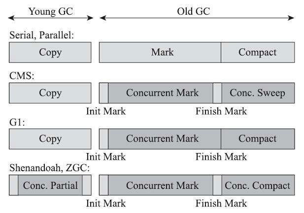

# 低延迟垃圾收集器

衡量垃圾收集器的三项最重要的指标是：

- 内存占用（Footprint）
- 吞吐量（Throughput）
- 延迟（Latency）

三者共同构成一个不可能三角，也就是不可能同时满足三个，最多只能同时满足其中两项。目前延迟这项的重要性日益凸显。

>上图中有个错误，G1 标记和整理阶段都需要暂停用户线程。

如上图，浅色阶段标识必须挂起用户线程，深色表示收集器线程与用户线程时并发工作的。

上图最后两款收集器，Shenandoah 和 ZGC，只有初始标记、最终标记阶段有短暂停顿，这部分停顿时间基本上是固定的，与堆的容量、堆中对象数量没有比例关系。它们可以在任意可管理的对容量下，实现垃圾收集的停顿不超过 10 毫秒。这两款目前仍处于实验状态的垃圾收集器，被官方命名为“低延迟垃圾收集器（Low-Latency Garbage Collector 或 Low-Pause-Time Garbage Collector）”。

## 1. Shenandoah收集器

## 2. ZGC收集器
