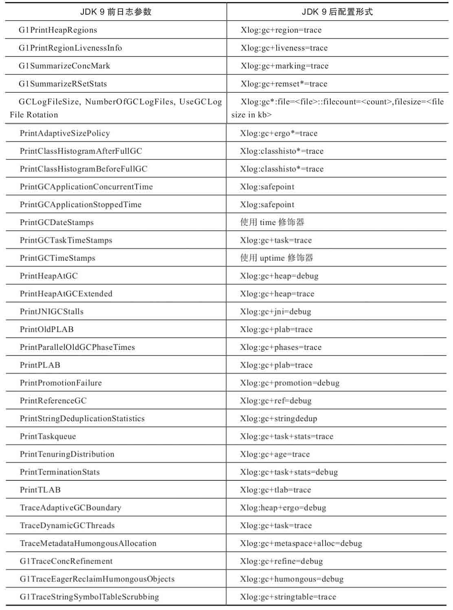
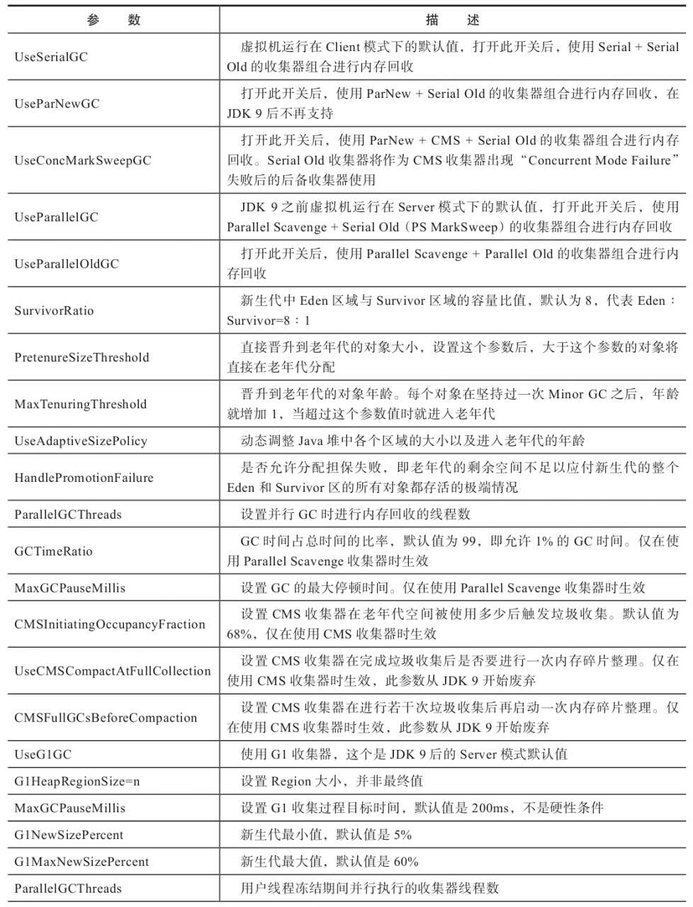
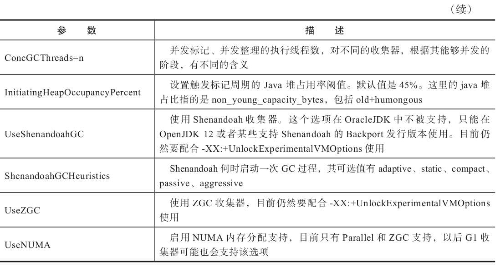

# 选择合适的垃圾收集器

垃圾收集器的工作：

- 堆的管理和对象的分配
  - 堆的管理与布局
  - 对象的分配
  - 与解释器的协作
  - 与编译器的协作
  - 与监控子系统协作
- 垃圾收集

>JDK10 开始，为了隔离垃圾收集器与 Java 虚拟机解释、编译、监控等子系统关系，RedHat 提出了垃圾收集器的统一接口。

## 1. Epsilon 收集器

由 RedHat 公司提出，是一款无操作收集器（A NoOp Garbage Collector），仅实现了堆的管理和对象的分配功能，不处理垃圾收集工作。

功能：

- 垃圾收集器统一接口的有效验证和参考实现
- 用于需要剥离垃圾收集器影响的性能测试和压力测试
- 应用于只需要运行几分钟甚至几秒，只要能够正常分配内存，在堆耗尽之前就会退出的小应用

## 2. 收集器的权衡

如何选择一款适合自己的收集器，主要受以下三个因素影响：

- 应用程序的主要关注点是什么？
  - 如果是数据分析、科学计算类的任务，目标是能尽快算出结果，那吞吐量就是主要关注点
  - 如果是 SLA 应用（SLA 服务等级协议（简称：SLA，全称：service level agreement）是在一定开销下为保障服务的性能和可靠性，服务提供商与用户间定义的一种双方认可的协定。通常这个开销是驱动提供服务质量的主要因素），那停顿时间直接影响服务质量，严重的甚至会导致事务超时，这样延迟就是主要关注点
  - 如果是客户端应用或者嵌入式应用，那垃圾收集的内存占用是主要关注点
- 运行应用的基础设施如何？
  - 硬件规格：系统架构 x86-32/64、SPARC、ARM/Aarch64
  - 处理器数量、分配内存的大小
  - 操作系统：Linux、Solaris、Windows
- 使用 JDK 的发行商是什么？版本号是多少？对应《Java 虚拟机规范》的哪个版本？
  - ZingJDK/Zulu
  - OracleJDK
  - OpenJDK
  - OpenJ9

如果是面向用户提供服务的 B/S 系统，一般来说延迟时间是主要关注点：

- 有钱但没调优经验：直接商业技术支持的专有硬件或软件解决方案
- 没钱，但有足够硬件：ZGC 或 Shenandoah
- 软硬件基础设施和 JDK 版本都比较落后
  - 内存在 4GB~6GB 一下：CMS
  - 更大内存：G1

>一切都要以实际情况测试之后再选择合适的收集器

## 3. 虚拟机及垃圾收集器日志

JDK9 之后，HotSpot 所有功能的日志合并到`-Xlog`参数上：

```bash
-Xlog[:[selector][:[output][:[decorators][:output-options]]]]
```

命令行中最关键的参数是选择器（Selector），由标签（Tag）和日志级别（Level）组成。标签可以理解为虚拟机中某个功能模块的名字，它告诉日志框架用户希望得到虚拟机哪些功能的日志输出，垃圾收集器的标签名称为`gc`。日志级别从低到高分别是 Trace、Debug、Info、Waring、Error、Off 六种，默认级别 Info。还可以使用修饰器（Decorator）来要求每行日志输出都附加上额外的内容，支持附加在日志行上的信息包括：

- time：当前日期和时间
- uptime：虚拟机启动到现在的秒数
- timemillis：当前时间的毫秒数
- uptimemillis：虚拟机启动到现在的毫秒数
- timenanos：当前时间的纳秒数
- uptimenanos：虚拟机启动到现在的纳秒数
- pid：进程 ID
- tid：线程 ID
- level：日志级别
- tags：日志输出标签集

如果不指定，默认值是 uptime、level、tags 三个，类似格式如下：

```log
[3.080s][info][gc,cpu] GC(5) User=0.03s Sys=0.00s Real=0.01s
```

通过几个例子对比 JDK9 前后如何获得垃圾收集器过程相关信息：

1. 查看 GC 基本信息
   - 前：-XX:+PrintGC
   - 后：-Xlog:gc
2. 查看 GC 详细信息
   - 前：-XX:+PrintGCDetails
   - 后：-Xlog:gc*，使用通配符将 GC 标签下所有细分过程都打印出来
3. 查看 GC 堆、方法区可用容量变化
   - 前：-XX:+PrintHeapAtGC
   - 后：-Xlog:gc+heap=debug
4. 查看 GC 过程中用户线程并发时间以及停顿时间
   - 前：-XX:+PrintGCApplicationConcurrentTime 与-XX:+PrintGCApplicationiStoppedTime
   - 后：-Xlog:safepoint
5. 查看收集器 Ergonomics 机制（自动设置堆空间各分代区域大小、收集目标等内容，从 Parallel 收集器开始支持）自动调节的相关信息。
   - 前：-XX:+PrintAdaptiveSizePolicy
   - 后：-Xlog:gc+ergo*=trace
6. 查看熬过收集后剩余对象的年龄分布信息
   - 前：-XX:+PrintTenuringDistribution
   - 后：-Xlog:gc+age=trace



## 4. 垃圾收集器参数总结




